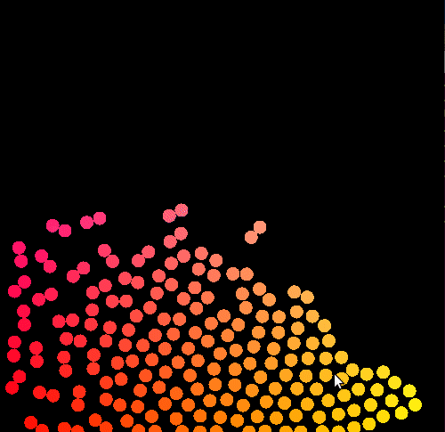
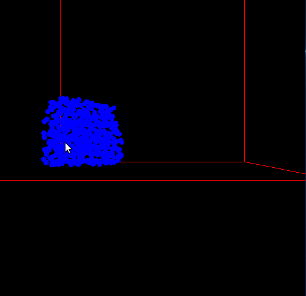

# Introduction
Realistic fluid animations are one of the most important phenomena in computer graphics. They are frequently used in computer gaming and visual effects industries. Fluids, in particular liquids such as water, are responsible for many visually rich phenomena, and simulating them has been an area of long-standing interest and challenge in computer graphics. Several approaches have been developed to this end, but in this project we focus on one of the most popular Lagrangian approach to fluid simulation: Smoothed Particle Hydrodynamics (SPH), specifically Muller's [2003] work on interactve fluid simulation.

SPH is an interpolation method for particle systems that distributes quantities in a local neighborhood of each particle using radial symmetrical smoothing kernels. According to SPH, a scalar quantity A is interpolated at location <b>r</b> by a weighted sum of contributions from all particles:

 AS(<b>r</b>) = &sum;jmj(Aj/&#961;j)W(<b>r</b>-<b>r</b>j, h)

Where mj is the mass of the particle j, rj is its position, ρj is its density and Aj the field quantity at rj.The mass term remains constant throughout the entire simulation but the density term keeps changing and has to be recalculated in each iteration. By substitution, we get the density at location <b>r</b> as:

&#961;S(<b>r</b>) = &sum;jmjW(<b>r</b>-<b>r</b>j, h)
 

Furthermore, the gradient and Laplacian of A are simply:

&nabla;AS(<b>r</b>) = &sum;jmj(Aj/&#961;j)&nabla;W(<b>r</b>-<b>r</b>j, h)&nbsp;&nbsp;&nbsp;and

&nabla;2AS(<b>r</b>) = &sum;jmj(Aj/&#961;j)&nabla;2W(<b>r</b>-<b>r</b>j, h)

# Particle Based Fluid Simulation
## Smoothes Particle Hydrodynamics
The use of particles instead of a stationary grid inherently accounts for the conservation of mass since the number of particles is fixed and the mass of each particle remains the same. Moreover, the substantial derivative of the velocity field in the Navier-Stokes equation can is reduced to the time derivative of the velocity of the particles, since the particles move with the fluid. This means that the convective term v·∇v is not needed for particle systems. The resultant equation is:

&#961;(dv/dt) = -&nabla;p + &#961;<b>g</b> + &mu;&nabla;2<b>v</b>

where the three force density fields on the RHS model pressure, external forces and viscosity, respectively. The acceleration of the particle i is then:

<b>a</b>i = d<b>v</b>i/dt = <b>f</b>i/&rho;i

## The Pressure Term
The application of SPH to the pressure field while accounting for symmetry yields the folowing equation:

<b>f</b>pressurei = -&nabla;p(<b>r</b>i) = -&sum;jmj(pi+pj)/2&rho;j&nabla;W(<b>r</b>j-<b>r</b>j,h)

Where the pressure term is simply pj = K(ρj-ρ0), K being the gas constant.

## The Viscosity Term
The application of SPH to the viscosity field while accounting for symmetry yields the folowing equation:

<b>f</b>viscosityi = &mu;&sum;jmj(<b>v</b>j-<b>v</b>i)/&rho;j&nabla;W(<b>r</b>j-<b>r</b>j,h)

## Surface Tension
The surface of the liquid can be found using an additional field quantity called the colour field. The smoothed colour field is as follows:

cS = &sum;jmj(1/&rho;j)W(<b>r</b>-<b>r</b>j, h)

The gradient of this field gives us the surface normal pointing into the fluid. Let this vector be n. Then the force density acting near the surface is:

fsurface = &sigma;&nabla;2cS<b>n</b>/|<b>n</b>|

## Smoothing Kernels
The authors use the following kernel functions in their paper: Wpoly6 for density and surface tension force calculatons, Wspiky for pressure force calculations and Wviscosity for viscosity force calculations. A detailed formulaion can be found in their paper.

# Discussion
The kernels used in the original paper yielded a somewhat unstable system. Hence, we had to make a few tweaks to the original algorithm to yield satisfactory results. We used slighty modified versions of the original kernel functions and discarded the surface tension forces in our implementations. We also observed that the velocities eventually shot up after multiple collisions, probably because our system used a minimum timestep for its computations. To handle this problem, we clamped the velocities of the particles in both the 2D and 3D systems. Unfortunately, we couldn't simulate more than a few hundred particles on our system at a go due to limitations on the available computational resources. We tested two integration techniques for velocity and position calculations - Leap Frog and Forward Euler. Surprisingly, the forward Euler technique gave better results than the former, with the former spiralling down to an unstable system faster when the velocities are not clamped.

# Results
Following are a few images of our simulations:

## The 2D Case

## The 3D Case

